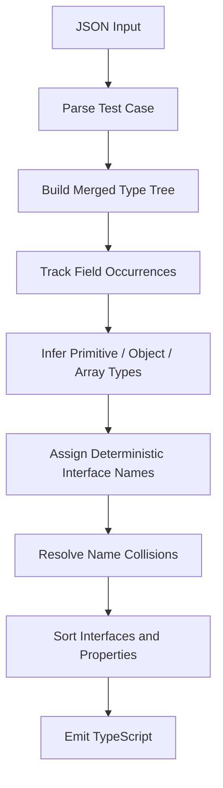

# JSON → TypeScript Type Generator

## Problem Statement

Given a JSON array of objects, generate a deterministic TypeScript type declaration. The challenge is stricter than ordinary JSON-to-TypeScript conversion because the output must follow exact rules for merging structures, optional properties, arrays, unions, interface naming, ordering, and formatting.

**Problem statement:** [HackerRank — Goldman Sachs India Hackathon 2026 CS](https://www.hackerrank.com/goldman-sachs-india-hackathon-2026-cs)  
**Local problem statement:** [`problem.md`](./problem.md)

## Solution

**Implementation:** [`solution.py`](./solution.py)

## Overview

This problem looks like a straightforward JSON-to-TypeScript conversion task, but the strict deterministic output rules make the underlying data model important.

The solution first builds a merged recursive representation of the JSON structure. Only after that does it assign interface names and emit TypeScript.

## Flow



## Internal Representation

Each merged object is represented by a node containing:

```text
Node
├── occurrence count
├── fields
├── primitive / category information
├── merged object child
└── merged array-element information
```

A field stores enough information to determine:

- whether it is optional
- which primitive types were observed
- whether it contains a nested object
- whether it contains an array
- what object/primitive types occur inside the array

## 1. Parse the Input

The program reads:

```text
T
root name
JSON array
```

for every test case and parses the JSON using Python's standard `json` module.

## 2. Build the Merged Type Tree

Every object in the input array contributes to the same root node.

For each property:

```text
object value     → merge recursively
array value      → merge array element information
primitive/null   → record its TypeScript type
```

A field's occurrence count is incremented whenever that field appears.

The number of objects merged into the current node is also tracked.

## 3. Optional Properties

Suppose three objects are merged and a property occurs in only two of them.

The property becomes optional:

```typescript
email?: string;
```

The implementation compares:

```text
field occurrence count
```

with:

```text
parent object count
```

A property explicitly containing `null` is still present and therefore is not made optional merely because it is `null`.

## 4. Type Inference

The primitive mapping is:

```text
string  → string
number  → number
boolean → boolean
null    → null
```

Nested objects are represented by generated interfaces.

## 5. Array Inference

All arrays observed at the same field are merged.

For example:

```json
[
  {"values": [1, 2]},
  {"values": ["x", "y"]}
]
```

becomes:

```typescript
values: (number | string)[];
```

An empty array with no observed element type becomes:

```typescript
unknown[]
```

Arrays can also contain objects and primitives together.

## 6. Interface Naming

Interface names are derived from immediate field names.

```text
address → Address
posts   → Posts
profile → Profile
```

The traversal used for assigning names is depth-first and processes sibling keys alphabetically.

Collisions use deterministic numeric suffixes:

```text
Address
Address2
Address3
```

## 7. Output Determinism

The final declaration is generated only after all interfaces and fields are known.

The implementation then:

1. sorts interface names
2. sorts properties
3. sorts union components
4. emits the exact required formatting

This prevents logically equivalent but textually different outputs.

## Complexity

Let `K` be the total number of keys encountered across all JSON objects.

The recursive merge is approximately:

```text
O(K)
```

The final ordering adds sorting cost, so a convenient upper-level description is:

```text
O(K log K)
```

depending on the number and distribution of generated fields/interfaces.

Memory usage is:

```text
O(K)
```

for the merged representation.
