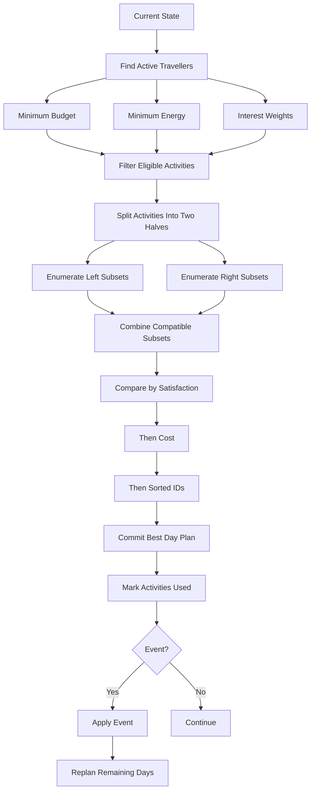

# Group Trip Planner

## Problem Statement

Plan a multi-day group trip by selecting activities that maximize group satisfaction while respecting shared budget, energy, duration, interest, and event-driven constraints. The planner must also re-plan the remaining itinerary whenever the state of the trip changes.

**Problem statement:** [HackerRank — Goldman Sachs India Hackathon 2026 CS](https://www.hackerrank.com/goldman-sachs-india-hackathon-2026-cs)  
**Local problem statement:** [`problem.md`](./problem.md)

## Solution

**Implementation:** [`solution.py`](./solution.py)

## Overview

The problem can be viewed as repeated constrained subset optimization.

For every day, the algorithm must choose a subset of currently eligible activities while respecting the tightest active traveller's:

- budget
- energy
- and the global time limit

The selected activities are then consumed from the pool.

Events can change the active travellers, their budgets, their energy levels, or weather restrictions, so the remaining schedule must be rebuilt.

## Decision Flow



## 1. Bottleneck Constraints

For a day, only the most restrictive active traveller matters for feasibility.

The limits are:

```python
budget_limit = min(user["budget"] for user in active)
energy_limit = min(user["energy"] for user in active)
```

This directly implements the fairness rule.

## 2. Satisfaction Weights

For each tag, calculate how many active travellers like it.

For example:

```text
FOOD      → 3
CULTURE   → 1
NATURE    → 2
```

If a selected activity has tag `FOOD`, it contributes `3` points.

The satisfaction of a subset can then be calculated from its tag counts instead of checking every traveller for every candidate.

## 3. Why Meet-in-the-Middle?

There are at most 20 activities.

A full subset search has:

```text
2^20 = 1,048,576
```

subsets.

That is not enormous, but the planner can be invoked repeatedly for multiple days and after events.

The activities are therefore split into two halves.

With approximately 10 activities per half:

```text
2^10 = 1024
```

subsets per side.

## 4. Subset Precomputation

For every subset, the implementation precomputes:

- total cost
- total energy
- total duration
- sorted activity IDs
- counts of activities for each interest tag

That means the expensive arithmetic is done once per half.

## 5. Combining the Two Halves

For every valid left subset:

```text
remaining budget
remaining energy
remaining duration
```

are calculated.

A right subset can be combined when all three remaining capacities are sufficient.

The combined candidate is represented as:

```text
(satisfaction, cost, sorted IDs)
```

and passed through the deterministic comparison rule.

## 6. Tie-Breaking

The comparison function:

```python
def better(a, b):
```

implements:

```text
higher satisfaction
    ↓
lower cost
    ↓
lexicographically smaller ID tuple
```

For example:

```text
[1, 4]
```

beats:

```text
[2, 3]
```

when their satisfaction and cost are equal.

## 7. Replanning

When an event occurs on day `d`:

```text
days 1 ... d-1 → keep fixed
days d ... D   → recompute
```

The implementation reconstructs the `used` activity set from the already fixed earlier days.

This ensures that previous decisions remain persistent while the future is optimized using the new state.

## 8. Weather

Weather restrictions are stored by day:

```python
weather[day] = set_of_blocked_tags
```

During daily optimization, an activity is excluded if its tag is currently blocked.

## 9. Determinism

Determinism comes from:

- sorting activities by ID
- sorting subset ID tuples
- sorting keys
- deterministic interface of `better()`
- deterministic weather/event application
- deterministic day-by-day replanning

## Complexity

With `A ≤ 20`, splitting into two halves gives approximately:

```text
2^(A/2) × 2^(A/2)
```

candidate combinations.

For `A = 20`:

```text
1024 × 1024 ≈ 1 million
```

candidate pair checks per day.

The approach is practical under the given limits.

Memory is approximately:

```text
O(2^(A/2))
```

for each half's precomputed subset tables.
