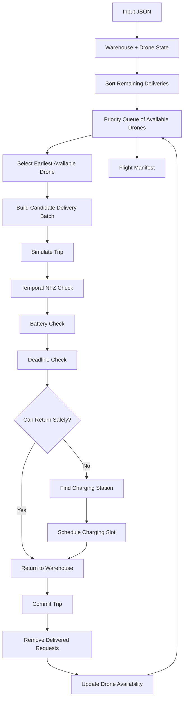

# Multi-Agent Drone Routing in a Temporal Urban Grid

## Problem Statement

Build a routing engine for a fleet of drones delivering packages across a coordinate grid while handling payload limits, battery consumption, delivery deadlines, time-dependent No-Fly Zones (NFZs), charging stations, and shared charging capacity.

**Complete Problem Statement:** [`problem.md`](./problem.md)

## Solution

**Implementation:** [`solution.py`](./solution.py)

## Overview

This is the most complex of the three challenges.

The routing engine has to reason about four different resources at once:

```text
Geometry
   +
Time
   +
Battery
   +
Shared charging capacity
```

The implementation uses a deterministic greedy scheduler combined with a trip simulator.

It is not an exhaustive globally optimal vehicle-routing solver.

## High-Level Architecture



## 1. Delivery Ordering

Remaining deliveries are sorted deterministically by:

```python
(
    deadline,
    -weight,
    x,
    y
)
```

This prioritizes earlier deadlines and gives deterministic secondary ordering.

## 2. Batching

The implementation attempts to put multiple deliveries on one trip.

A bounded candidate pool is used:

```text
MAX_SCAN
MAX_PER_TRIP
```

This avoids searching every possible route combination.

A candidate batch is first constructed greedily.

If the full batch cannot be simulated successfully, smaller prefixes are tried.

## 3. Temporal NFZ Geometry

The most technically important part is determining whether a straight-line flight intersects an NFZ at a time when that NFZ is active.

The implementation uses exact segment-intersection intervals.

### Circle

A segment is represented parametrically:

```text
P(u) = A + u(B - A)
```

where:

```text
0 <= u <= 1
```

For a circle:

```text
|P(u) - C|² = r²
```

produces a quadratic equation.

Its roots identify the portion of the segment inside the circle.

### Rectangle

A Liang-Barsky-style parametric clipping approach determines the interval where the segment lies inside the rectangle.

## 4. Convert Spatial Intersection Into Time

Because speed is exactly 1:

```text
time = distance
```

If the segment intersects an NFZ between path fractions `u1` and `u2`, those fractions can be converted into an absolute time interval.

That turns:

```text
geometry
```

into:

```text
temporal blockage
```

## 5. Safe Departure

The function:

```python
safe_depart_time()
```

collects the forbidden time intervals for the segment.

If the current departure time is unsafe, it advances to the end of the relevant forbidden interval.

Waiting consumes no battery.

This allows the route to remain a straight segment instead of requiring a geometric detour in every case.

## 6. Battery Simulation

For each leg:

```text
energy = distance × (1 + payload)
```

The implementation starts each trip with the drone's current battery state and subtracts the leg cost.

After a delivery:

```python
payload -= delivered_weight
```

so later legs become cheaper.

## 7. Return Feasibility

After all deliveries in a batch are complete, the simulator first checks whether the drone can return directly to the warehouse.

If the remaining battery is sufficient, the direct return is used.

Otherwise the implementation evaluates nearby charging stations.

## 8. Charging Station Scheduling

Each station maintains bookings:

```text
(start_time, end_time)
```

A proposed booking is accepted only when the station's concurrent usage stays within its `slots`.

If necessary, the drone waits until an interval becomes available.

The relevant charge duration is:

```text
required_energy / 2
```

because the charge rate is 2 units per timestep.

## 9. Multi-Drone Scheduling

Drone availability is handled with a min-heap:

```python
(time_available, drone_index)
```

The earliest available drone is processed next.

After a successful trip:

```python
drone["time"] = success["end_time"]
```

and it is inserted back into the heap.

This creates an event-driven scheduling loop without requiring a global time-step simulation.

## 10. Transactional Trip Simulation

A candidate route is simulated before it changes the global state.

The simulator checks:

```text
payload
battery
NFZ state
deadlines
charging availability
return feasibility
```

Only a successful simulation is committed.

This avoids corrupting the manifest with partially valid trips.

## 11. Determinism

The implementation deliberately uses deterministic ordering for:

- deliveries
- candidate stations
- station tie-breaking
- drone availability
- station bookings

This means the same input produces the same routing decisions.

## 12. Design Trade-off

The implementation is a **deterministic greedy/heuristic routing strategy**, not an exact global optimizer.

That distinction matters.

The full problem combines:

- multiple vehicles
- delivery sequencing
- payload constraints
- battery constraints
- time windows
- time-dependent obstacles
- shared charging resources

An exact global optimizer would face a much larger combinatorial search space.

The implementation instead aims to construct valid, high-quality routes efficiently.

## Complexity

Let:

- `M` = number of deliveries
- `N` = number of drones
- `Z` = number of NFZs
- `S` = number of charging stations

The scheduler uses bounded candidate batches, so it avoids unrestricted route enumeration.

Each simulated leg checks the relevant NFZs and, when needed, a bounded number of candidate charging stations.

The overall implementation is therefore heuristic and input-dependent rather than characterized by a single exact polynomial bound for the global routing problem.
